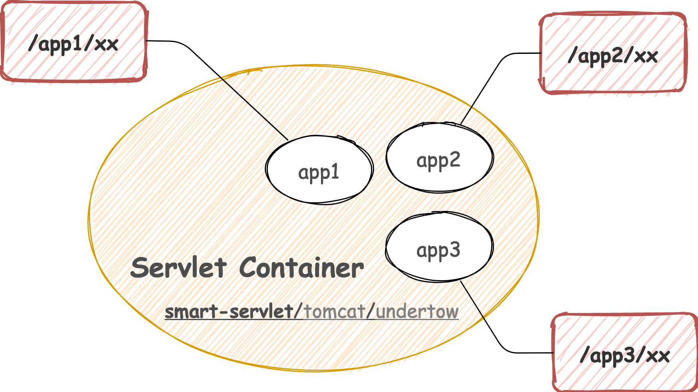
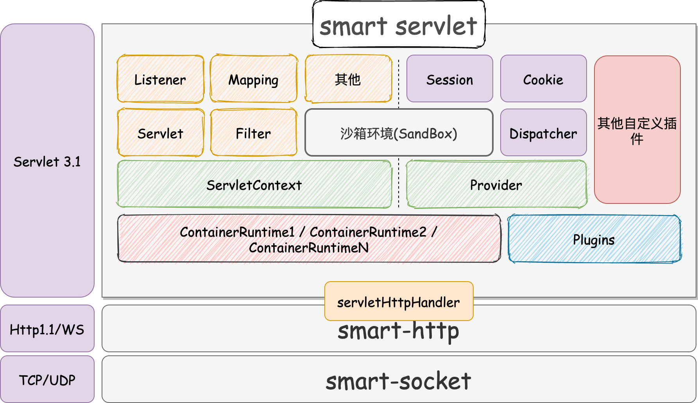

# smart-servlet
smart-servlet 是一款实现了Servlet 3.1规范，支持多应用隔离部署的的 Web 容器。除此之外，smart-servlet 还是一款插件化容器，基于内置的沙箱环境确保 smart-servlet 拥有最精简的运行能力，用户还可以通过自定义插件扩展容器的服务能力。



## Part 1. 项目概述

smart-servlet 在 smart-http 的架构之上，通过继承 HttpHandle 实现了 Servlet 规范。这意味着任何 smart-http 服务都可以通过单独引入 smart-servlet 核心包的方式，将普通的 http 应用改造成 servlet 应用，而且这个成本是极低的。



为了更好融入现有的 Java 技术生态，尤其是 Spring 生态，我们在应用层面做了很多便利的设计：

- binary distributions

  二进制软件包，可将 War 包部署到指定目录下以启动服务。类似：apache-tomcat-x.xx.xx.tar.gz

- maven plugin

  通过maven插件的形式集成 smart-servlet，用于本地项目开发调试。类似于：tomcat7-maven-plugin。

- springboot starter

  类似于： spring-boot-starter-tomcat、spring-boot-starter-undertow、spring-boot-starter-jetty。

### 版本说明

|  功能清单 | 社区版  | 付费版 | 说明 |
|  :---  | :--:  |  :--:  |  ----  |
| 开源 | :white_check_mark: |:no_entry_sign:| 付费版是在社区版的基础上提供一些增强能力，可以理解为社区版是付费版的子集。具体差异以实际发布版本为准。 |
| 商用能力 | :x: |:white_check_mark:| 社区版相较付费版所缺少的授权项，在某些情况下可能无法满足企业商用标准 |
| 软件包 | :white_check_mark: |:white_check_mark:| 开箱即用，解码后可部署 War 包运行，用于生产环境部署。 |
| maven-plugin  | :white_check_mark: |:white_check_mark:| 集成pom.xml本地启动服务 |
| springboot starter  | :white_check_mark: |:white_check_mark:| 继Tomcat、Undertow、Jetty之后的第四个spring-boot-starter-web包 |
| 多应用部署 | :white_check_mark: |:white_check_mark:| 通过类加载器的隔离机制，实现单Web容器部署多应用 |
| JSP页面支持 | :x: |:white_check_mark:|  |
| Session规范 | :white_check_mark: |:white_check_mark:|  |
| Cookie规范 | :white_check_mark: |:white_check_mark:|                                                              |
| 服务配置维护 | 默认 |自定义| 社区版采用了默认的服务配置，仅适合本地项目的开发、调试。如需应用到生产环境，需要购买付费版以作服务配置调优。 |
| 价格 | 免费 |订阅制| *具体方案待定* |

如何选择适合自己的版本？

- 社区版：

  提供了完整的Servle规范实现，可供技术人员学习交流。

  具备了基本的运行能力，可用于本地的开发调试。

  对于低流量的个人站点，亦可部署社区版（应对高并发的能力有限）。

- 收费版：

  提供专业级的Web容器服务能力，支持参数调优以获得最佳的性能、稳定性表现。

  适合本地开发调试，以及生产环境应用。

  采用订阅制模式收取一定费用，为了更好的建设、发展该项目。

### 如何购买

- 目前项目还处于研发期，仅开放**社区版**供大家**免费下载**体验。
- 具体方案以项目实际发展状况再作设计，如果我们能找到良性的发展方向，不排完全免费的可能性。
- 对本项目有卓越贡献的用户，将有机会免费获得收费版授权。贡献方式包括且不限于：贡献代码、功能测试、核对规范实现一致性、产出文档、推广本项目。
- 本项目的捐赠者在项目正式发布前享有提前体验权利，有意向的朋友请前往【**[捐赠入口](https://smartboot.gitee.io/book/donation.html)**】，并在捐赠后及时与我取得联系。

### 代码贡献者

[三刀](https://gitee.com/smartdms)、[**@cwq108**](https://gitee.com/cwq108)、[**@slef**](https://gitee.com/slef)

## Part 2. 操作手册

smart-servlet 还未正式发布，如需体验需要通过本地编译来使用，请按以下步骤操作：

1. 拉取本仓库代码。

2. 进入工程主目录执行 `mvn install`，当控制台出现以下信息时，说明编译成功。

   ```shell
   [INFO] ------------------------------------------------------------------------
   [INFO] Reactor Summary:
   [INFO] 
   [INFO] smart-servlet-parent ............................... SUCCESS [  1.168 s]
   [INFO] servlet-core ....................................... SUCCESS [ 10.142 s]
   [INFO] smart-servlet-spring-boot-starter .................. SUCCESS [  2.107 s]
   [INFO] smart-servlet-maven-plugin ......................... SUCCESS [  6.330 s]
   [INFO] ------------------------------------------------------------------------
   [INFO] BUILD SUCCESS
   [INFO] ------------------------------------------------------------------------
   
   ```

3. 根据你自身的工程情况选择相应的集成方式。

   - maven plugin

     面向传统的 Servlet 或者 Spring MVC 工程，但必须是maven工程。需要在 web 模块所在的pom.xml中加入以下配置，若存在端口冲突自行调整。
   	```xml
     <!-- pom.xml -->
     <project>
      <build>
        <plugins>
          <plugin>
            <groupId>org.smartboot.servlet</groupId>
            <artifactId>smart-servlet-maven-plugin</artifactId>
            <version>1.0.0-SNAPSHOT</version>
            <configuration>
              <port>8080</port>
            </configuration>
          </plugin>
        </plugins>  
      </build>
     </project>
     ```

   - springboot starter

     对于Springboot提供的集成方式，替换原 spring-boot-starter-web 默认绑定的 Servlet 容器。

     ```xml
      <!-- pom.xml -->
      <project>
        <dependencies>
          <dependency>
            <groupId>org.springframework.boot</groupId>
            <artifactId>spring-boot-starter-web</artifactId>
            <exclusions>
              <exclusion>
                <groupId>org.springframework.boot</groupId>
                <artifactId>spring-boot-starter-tomcat</artifactId>
              </exclusion>
            </exclusions>
          </dependency>
          <dependency>
            <groupId>org.smartboot.servlet</groupId>
            <artifactId>smart-servlet-spring-boot-starter</artifactId>
            <version>1.0.0-SNAPSHOT</version>
          </dependency>
        </dependencies>
      </project>
     ```

4. 完成配置，下一步启动你的应用。


## 特别说明

本项目还处于研发阶段，还未完成所有 Servlet 标准的兑现。如若在使用过程中发现问题可提 [Issues](https://gitee.com/smartboot/smart-servlet/issues) 反馈，我们会尽快安排处理，感谢您的理解和支持！

QQ交流社群：1167545865（付费制），入群福利：

1. 前20名免费入群。
2. 掌握 smart-servlet 的第一手资讯。
3. 深入探讨 Servlet 规范及服务器开发经验。
4. 与同类开发人群成为朋友。

## 项目推荐
- [smart-socket](https://gitee.com/smartboot/smart-socket)  
    极简、易用、高性能的AIO通信框架，5G时代的通信微内核，适用于IM、RPC、IoT等诸多领域
- [smart-http](https://gitee.com/smartboot/smart-http)  
    基于smart-socket实现的轻量级http服务器