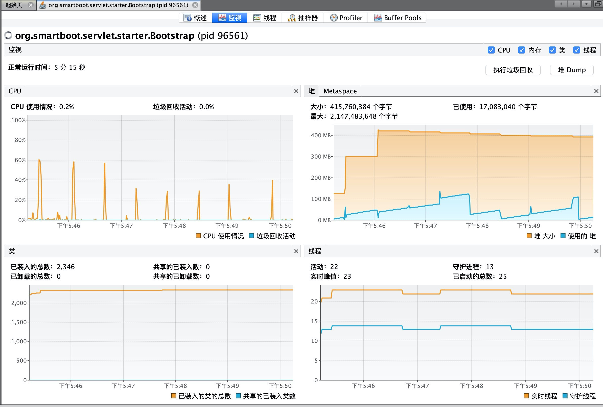

# 评测数据

## 一、测试结果

| 规范清单     | Tomcat 9 | smart-servlet |
| ------------ | -------- | ------------- |
| Servlet Spec | 4.0      | 3.1           |
| Jsp Spec     | 2.3      | N/A           |

在相同的测试工程下：

- smart-servlet 性能表现结果比 tomcat 高出 50%~100 以上 。
- tomcat 压测期间 CPU 使用率高于 40%，smart-servlet 压测时低于 40% 。
- tomcat 线程数随并发数递增，上限 200；smart-servlet 线程数固定，不受并发数影响 。
- 内存开销两者基本持平。

> 评测在不同的测试方式、测试环境下会有不同的表现。本文结论仅供参考，请以自己的实际测试结果为准。

## 二、压测过程

测试方式：先执行 3 次压测，使服务器完成预热，每次压测前都确保端口充分释放。

### 2.1 ApacheBench 压测

#### 2.1.1 并发量：100

**测试命令**

```shell
ab -k -c100 -t 10 http://127.0.0.1:8080/examples/servlets/servlet/HelloWorldExample
```

**测试结果**

| tomcat / smart-servlet | Requests per second [count/sec] | Transfer rate [Kbytes/sec] | 累计YGC | 累计FGC |
| ---------------------- | ------------------------------- | -------------------------- | ------- | ------- |
| 第 1 轮                | 18536.55 / 37129.34             | 11689.08 / 22806.99        | 18 / 22 | 1 / 0   |
| 第 2 轮                | 21194.69 / 32753.81             | 13365.34 / 20119.28        | 23 / 28 | 1 / 0   |
| 第 3 轮                | 22588.81 / 36523.28             | 14244.43 / 22434.71        | 27 / 34 | 1 / 0   |
| 第 4 轮                | 20171.81 / 35668.17             | 12720.25 / 21909.45        | 32 / 42 | 1 / 0   |
| 第 5 轮                | 21957.96 / 30439.92             | 13846.64 / 18697.96        | 37 / 52 | 1 / 0   |

**压测小结：**

- 从 ab 产生的结果来看 smart-servlet 的性能比 tomcat 高出 50%~100% 。
- 而且从下图可以看到压测期间 tomcat 线程数增长至 118，而 smart-servlet 始终稳定在 23。
- tomcat 不能很好的支持 http1.0 keep-alive。ab采用了的协议是 Http1.0，压测 tomcat 过程中发现实际建立的连接数超过了500个，而 smart-servlet 稳定在100个。


#### 2.1.2 并发量：150

**测试命令**

```shell
ab -k -c150 -t 10 -r http://127.0.0.1:8080/examples/servlets/servlet/HelloWorldExample
```

**测试结果**

| Tomcat / smart-servlet | Requests per second [count/sec] | Transfer rate [Kbytes/sec] | 累计YGC | 累计FGC |
| ---------------------- | ------------------------------- | -------------------------- | ------- | ------- |
| 第 1 轮                | 18402.97 / 40874.22             | 11605.02 / 25107.31        | 30 / 16 | 1 / 0   |
| 第 2 轮                | 25367.06 / 45381.93             | 15996.65 / 27876.21        | 37 / 19 | 1 / 0   |
| 第 3 轮                | 25935.43 / 41616.07             | 16355.01 / 25563.00        | 44 / 21 | 1 / 0   |
| 第 4 轮                | 26399.91 / 44049.76             | 16647.90 / 27057.91        | 52 / 25 | 1 / 0   |
| 第 5 轮                | 24079.55 / 49325.96             | 15184.70 / 30298.86        | 61 / 29 | 1 / 0   |

**压测小结：**

- 在 150 的并发下 smart-servlet 的性能比 tomcat 高出 50%~100% 。
- tomcat 线程数增长值 169，smart-servlet 维持23个不变。




#### 2.1.3 并发量：1000

**测试命令**

```shell
ab -k -c1000 -t 10 -r http://127.0.0.1:8080/examples/servlets/servlet/HelloWorldExample
```

**测试结果**

| smart-servlet | Requests per second [count/sec] | Transfer rate [Kbytes/sec] | 累计YGC | 累计FGC |
| ------------- | ------------------------------- | -------------------------- | ------- | ------- |
| 第 1 轮       | 37633.03                        | 23116.38                   | 15      | 0       |
| 第 2 轮       | 35776.23                        | 21975.83                   | 17      | 0       |
| 第 3 轮       | 39916.91                        | 24519.27                   | 19      | 0       |
| 第 4 轮       | 38895.61                        | 23891.93                   | 21      | 0       |
| 第 5 轮       | 39318.90                        | 24151.94                   | 22      | 0       |

压测小结：在此并发量下 tomcat 失败率太高，不再进行评测。

